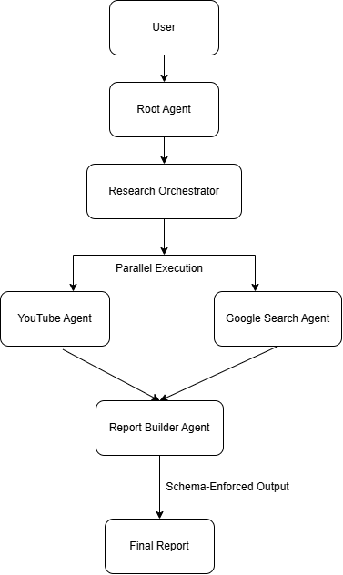
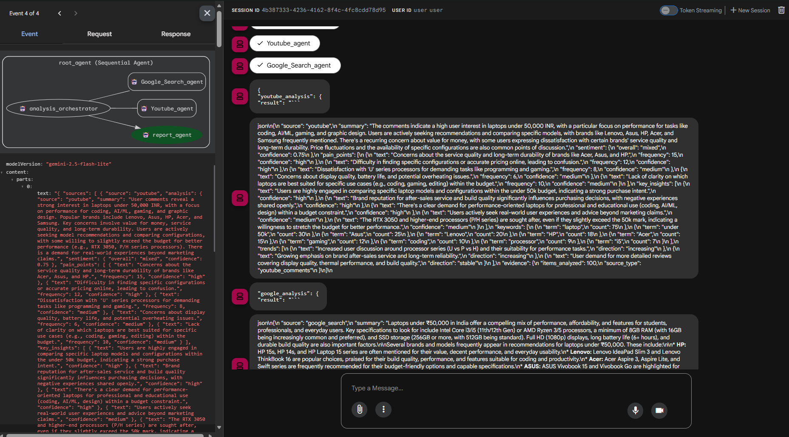
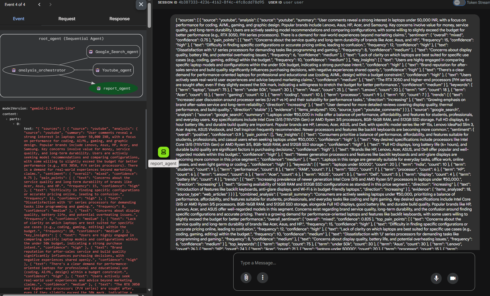
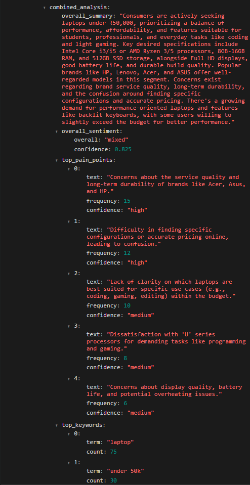

# ART Finder – AI-Powered Market Research System

ART Finder is a **multi-agent AI system** that automates market research by aggregating and analyzing user feedback from platforms like YouTube and web sources.  
It extracts **user pain points, sentiment, trends, and keywords** and produces a **deterministic, structured research report**.

---

## 🔍 Problem Statement

Market research is often manual, time-consuming, and subjective.  
Reading thousands of user comments or web articles makes it difficult to extract consistent and actionable insights.

ART Finder solves this by:
- Automating data collection from multiple sources
- Using agent-based analysis for modularity and scalability
- Enforcing structured outputs to avoid hallucinations

---

## 🧠 Key Idea

The core idea behind ART Finder is **separation of concerns**:

- **Parallel data collection & analysis**
- **Deterministic report generation with schema enforcement**

This design ensures reliability, extensibility, and control over LLM behavior.

---

## 🏗️ System Architecture

### Architecture Overview

1. **User Query**
2. **Root Sequential Agent**
3. **Research Orchestrator (Parallel Execution)**
   - YouTube Analysis Agent
   - Google Search Analysis Agent
4. **Raw Structured JSON Output**
5. **Report Builder Agent (Schema Enforced)**
6. **Final Research Report**

---

## 🤖 Agents Overview

### 1️⃣ YouTube Analysis Agent
- Fetches YouTube comments related to the topic
- Extracts sentiment, pain points, trends, and keywords
- Outputs structured JSON

### 2️⃣ Google Search Analysis Agent
- Analyzes web articles and search results
- Extracts market insights and feature trends
- Outputs structured JSON

### 3️⃣ Research Orchestrator Agent
- Executes source-specific agents in **parallel**
- Collects and returns raw structured outputs
- Does **not** summarize or infer

### 4️⃣ Report Builder Agent
- Aggregates insights across sources
- Deduplicates overlapping signals
- Resolves sentiment conflicts
- Enforces output structure using **Pydantic schema**

---

## 📊 Sample Outputs

### YouTube Analysis Output

This output contains sentiment analysis, user pain points, trends, and keywords extracted from YouTube comments.

---

### Google Search Analysis Output

This output represents insights derived from web articles and search results related to the given topic.

---

### Combined Research Report (Final Output)

(./images/combined_output2.png)

The final report aggregates insights across all sources, resolves conflicts, and produces a deterministic, schema-validated research output.

The final output includes:
- Overall summary
- Sentiment analysis
- User pain points with confidence
- Keywords for marketing
- Trends across sources

---

## 🛠️ Tech Stack

- **Python**
- **Google Agent Development Kit (ADK)**
- **Gemini LLM**
- **Pydantic (Schema Enforcement)**
- **YouTube Data API**
- **Google Search Integration**

---

## 📄 Documentation & Recognition

- Authored formal project research and system documentation
- Received an official **copyright certificate**
  for the ART Finder project documentation

---

## 🚀 Future Improvements

- Add more source agents (Reddit, forums)
- Store embeddings in a vector database for semantic search
- Add caching for repeated queries
- Build a lightweight frontend dashboard

---

## 📌 Disclaimer

The problem statement originated from a hackathon theme.  
The focus of this project is on **system design, agent orchestration, and reliable AI application development**.
